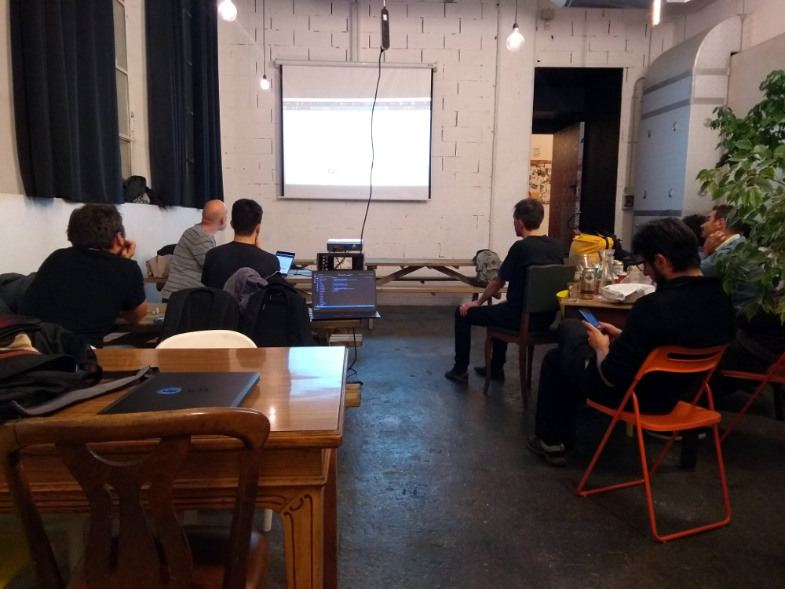
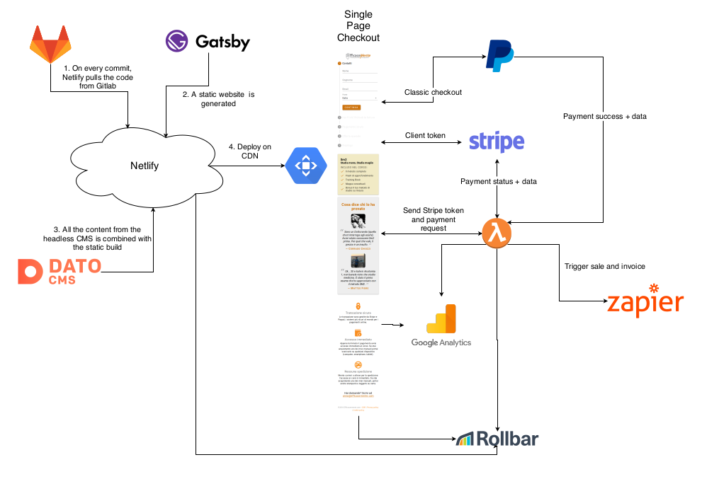
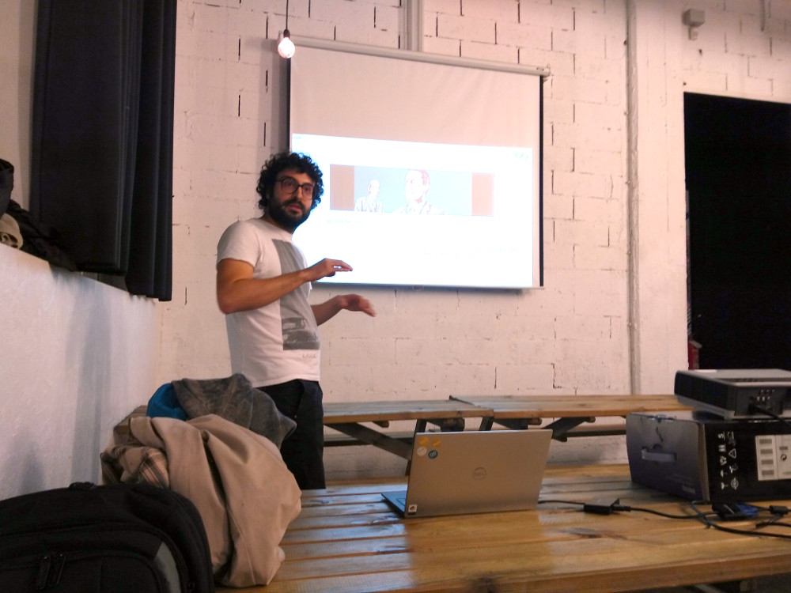
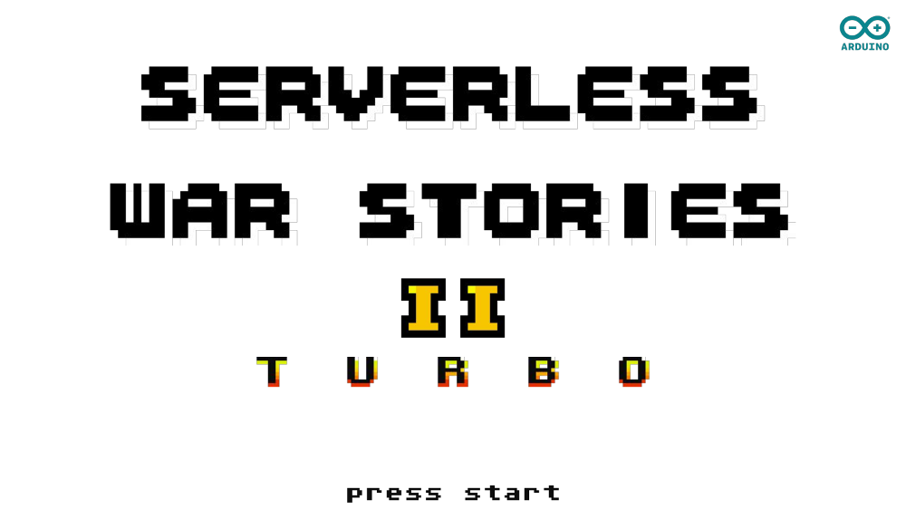
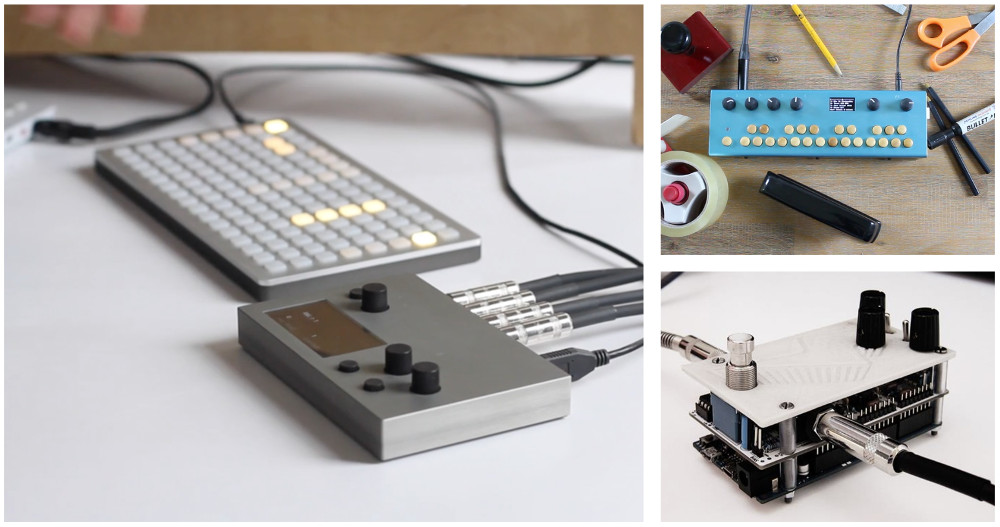
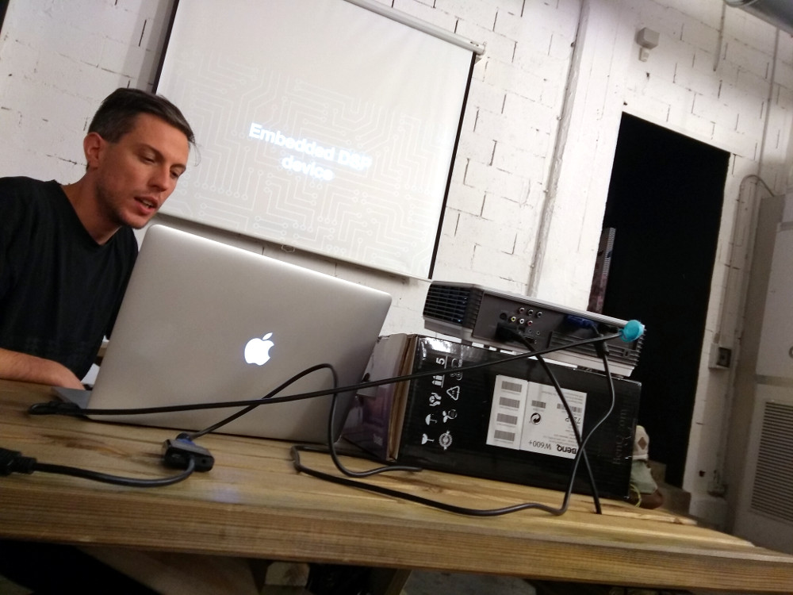
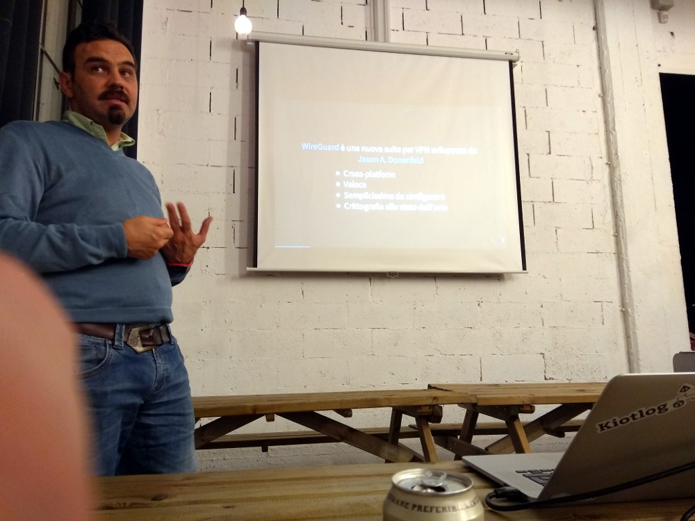
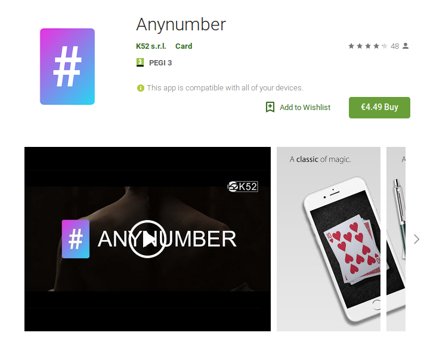
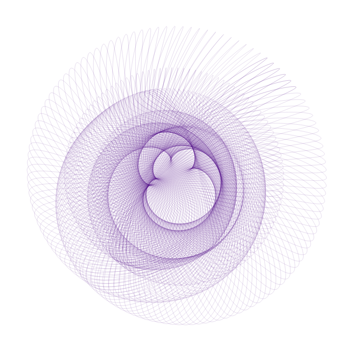

# Show and tell 3

After a break longer than expected, we are back!

## Efficacemente
Together with Alberto, we presented how we implemented the [Efficacemente checkouts](https://checkout-sm2.efficacemente.com/) using a bunch of hipster tools: [GatsbyJS](https://www.gatsbyjs.org/), [Material UI](https://material-ui.com/), [Netlify](https://www.netlify.com/), [DatoCMS](https://www.datocms.com/), [AWS Lambda](https://aws.amazon.com/lambda/), [Serverless](https://serverless.com/), [Zapier](https://zapier.com/), [Rollbar](https://rollbar.com/), [Stripe](https://stripe.com/) and [PayPal](https://www.paypal.com/). Puff, pant!

Here's a summary of the interactions between the tools, that we tried to present to everyone:

Starting on the cons side, the complexity is surely not trivial. But we also have many pros:
- very low cost (~$0/month at low usage). Only Zapier has a fixed cost if you do complex stuff
- crazy scalability! With zero OPS effort we have a massively scalable web application. And this was one of the prerequisites of the client
- very low maintenance. Unexpectedly, the app has proved quite robust :) Apart from minor glitches on launch it has proved being resilient. The tech we are using is not so hipster anymore, and very good for production usage

Time for the next serverless-related presentation.

## Roberto Sora - Serverless war stories

Roberto presented a personal story on his own dev ops experiences with AWS.

Begins with _serverful_ approach.
Logging, monitoring, deploying 500 to 10.000 instances. Yes, _thousands_ EC2 instances.  
Turning up and down machines, attaching/detaching load balancer and whatever else you need to do with a fleet of thousands of instances.  
Everything with a pile of Java code and loads of manual tasks.

This is definitely a war.

After the scary part, he has a second opportunity. A new project starting from scratch, but now with serverless approach.

Everything based off AWS events and glue code. Events are sent to Lambda that glues everything together.

Some ese cases presented:
- cron jobs
- AWS ops automation
- step functions
- web app
- data analysis

Nice pluses are simple reproducibility and testing.

Best of breed: [AWS Lambda](https://aws.amazon.com/lambda/) + [Serverless](https://serverless.com/) + Python + [Boto 3](https://github.com/boto/boto3).

Very informative and unexpectedly funny presentation. Thanks a lot Roberto!

## Matteo Bertini - Mergebot on Rust power
Matteo has presented a neat CLI tool written in Rust that he's using to automate his Gitlab MR review process. In particular he needed to optimise the rebase and merge process, that Gitlab doesn't support, yet.

Here's some Rust code! https://hackmd.io/p/r1_JTngnQ#/

Useful libraries used:
- CLI tool with [quicli](https://github.com/killercup/quicli)
- CLI arg parsing with [CLAP](https://clap.rs/)
- together with [StructOpt](https://github.com/TeXitoi/structopt)
- JSON parsing similar to what [reqwest](https://github.com/ded/reqwest) does to populate objects

Then some Rust showing off with Lambda functions.

Personally I've been happy to see something completely different from what I normally do, mind expanding! Thank you Matteo.

## Elia - Embedded DSP device
To stay on the mind-expanding theme, we are going to dive deep into musical gear now. Elia has presented his research into building his own embedded DSP device.

His idea is to build a custom embedded DSP instrument to use live. The base is going to be a computer with Pure Data or SuperCollider. Before starting to build his own one he's done a comprehensive analysis of what's around.

Here's his picks:
- [bela.io](http://bela.io/) -> custom Linux distro, difficult to mod
- [pisound](https://blokas.io/pisound/)
- [Norns](https://monome.org/norns/) from the Monome crew a RPi SoC!
- [Granular convolver](http://daily.redbullmusicacademy.com/2018/09/the-granular-convolver): using buildroot, SuperCollider and Jack

Lots of cool gear and I can't wait to see what's coming next. Cool stuff, thank you!

## Giampaolo - Hello world, wireguard!
Giampaolo presented an easy to use, reliable and powerful VPN too, Wireguard.

*haha, there's also my finger*

Wireguard is a cross-platform, fast, simple, apparently safe VPN solution.

Interesting points:
- it generates a "Real" virtual network card, no tunnels or other things
- one liner to generate keys
- simple interface card setup
- one liner to persist config

BUT it's not yet in the master linux kernel, but Linus himself is pushing to get it onboard.

Giampaolo has developed Ansible roles to install on RPi which makes it super easy to manage.

Last but not least: Andoid, Mac, Win compatible.

Have the full read below, and thanks again!

## Enrico - Anynumber (on Unity)
Enrico has presented an Android magic game that has developed for a client, Anynumber:

It's demoed the game with a spectacular effect!

He has developed it in C# on Unity, but now he's facing a problem, how to go faster?!? He's looking for fellow Unity developers to improve the performance of the app.

Thank you for the funny demo, and good luck for your search!

## Silvano - Notebook interface
Silvano has presented his latest endevour with D3 visualisations.

The drawing itself is very cool already, but the story behind it is even better.

Silvano has started showing how he's been inspired by the mechanical drawing machines of [James Nolan Gandy](http://www.jamesnolangandy.com/). He wanted to understand how the machines work on a mathematical level. So he started out using [Mathematica](https://www.wolfram.com/mathematica/) by Stephen Wolfram to draw and understand the maths behind it.

It's a tool that lets you alternate code, text, images, audio, graphs, etc. On the same path there's [Jupyter](https://jupyter.org/) born in Python, now supports everything, very popular in academia.

But then he showed [Observable](https://beta.observablehq.com/) a similar tool using HTML+CSS+JS, all online. The end result is here: [A drawing machine](https://beta.observablehq.com/@sistrall/a-drawing-machine), with nice explanations and interactive images!

Great stuff, thank you so much.

## Conclusions
And that's all for this round. I've been really impressed by the quality, the friendliness and the willing to share.

I hope to make these events a bit more regular, stay tuned and let's keep in touch!
