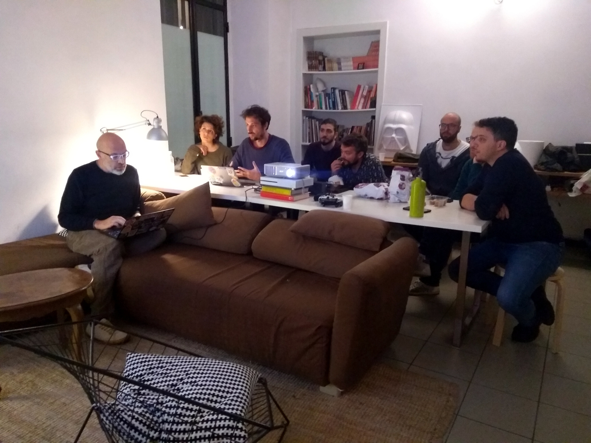

# Show and tell 4

Questa volta siamo gentilmente ospitati dagli amici di [Piramid](https://piramid.studio/)! :)

Grazie a tutti!!

Ecco un piccolo report.

## Serverless pre-rendering

Ho rotto il ghiaccio tentando di parlare di [serverless pre-rendering](https://zeit.co/blog/serverless-pre-rendering).

Ho presentato una piccola [demo](https://github.com/matjack1/spr-landing-datocms) che mette insieme Next.JS, DatoCMS e Zeit Now, la piattaforma di deployment di Zeit, che ci permette le magie che ho fatto vedere.

Next.JS renderizza le pagine lato server e scrive nella cache di Zeit. Quando un utente arriva sulla pagina, viene eseguito il codice sul server, solo se non è presente in cache. Altrimenti una volta caricata la pagina c'è [questo pezzo di codice](https://github.com/matjack1/spr-landing-datocms/blob/master/pages/index.js#L140) che scarica la pagina in background e se l'hash è diverso la pagina si ricarica.

Questo ha il magico effetto di ricaricare la pagina appena si cambia il contenuto su Dato. Quindi abbiamo l'effetto di avere pagine in cache, veloci come un sito statico, ma con la versatilità del server side rendering.

Praticamente magia nera.

## SanctuaryJS

Silvano presenta [SanctuaryJS](https://sanctuary.js.org/), una libreria JS per darsi alla programmazione funzionale.

Sanctuary deriva dal lavoro fatto su [ramda](https://github.com/ramda/ramda) che a sua volta deriva da [lodash](https://github.com/lodash/lodash).

Facciamo insieme un paio di esempi e spiegazioni sulla sintassi, sul perché dell'interesse per la prog funzionale.

Per fare passi avanti alcuni suggerimenti:

 - la [chat Gitter di Sanctuary](https://gitter.im/sanctuary-js/sanctuary) spacca. Con l'autore e altre discussioni molto interessanti sul tema.

 - bel [video di introduzione](https://www.youtube.com/watch?v=4WiNwODrYGI) a Sanctuary

 - una [intro alla programmazione funzionale](https://github.com/gcanti/functional-programming) in italiano

## Gatsby

Steffoz ci presenta [Gatsby](https://www.gatsbyjs.org/), un framework React per generare siti statici e molto altro.

L'idea interessante di Gatsby è che mette insieme un tot di buone pratiche di sviluppo web, in particolare vediamo come gestisce le immagini.

Senza dovere pensare a niente, Gatsby offre alcune opzioni per caricare più velocemente le immagini: blur up, traced svg, background color, webp... ecco [una bella demo di esempio](https://using-gatsby-image.gatsbyjs.org/).

Oltre a queste ottimizzazioni le immagini vengono scaricate solo quando vengono visualizzate on scroll.

Le immagini responsive sono gestite automaticamente, vengono generati i thumbnail delle dimensioni giuste e viene generato il srcset corretto ecc ecc.

Nel Graphql di Gatsby si possono vedere tutti i parametri generati. L'idea è di prendere il fragment graphql e buttarlo nel componente img da gatsby-image e magicamente fa tutto lui. Boom.

Ultima magia interessante, in sviluppo è [blurhash](https://blurha.sh/). Un'altra opzione magica per sveltire il precaricamento.

## Gridsome

[Stefano Ordine](https://bravelycoding.it/) ci fa vedere l'altro lato della barricata. [Gridsome](https://github.com/gridsome/gridsome/), alternativa a Gatsby che usa Vue.JS.

Vediamo insieme una bella demo [Gridsome + DatoCMS](https://slides.com/stefanoordine/generating-static-sites-with-gridsome#/generating-static-sites-with-gridsome) presentata al Vue.JS day :)

E poi esploriamo componenti React in TypeScript. Si definiscono tipi invece di classici proptype. Molto utile per autocomplete (su VSCode), specialmente per aiutare nel leggere le proprietà di eventi o altri oggetti che altrimenti normalmente non saresti sicuro di cosa ti può arrivare.

Per includere librerie non TS c'è [@types/blabla](https://basarat.gitbooks.io/typescript/docs/types/@types.html) che include le definizioni dei tipi generati automaticamente con [dts-gen](https://github.com/Microsoft/dts-gen), che si può usare anche su librerie già fatte in JS e guadagnarci di più usandole in TS.

Stefano, sarebbe bello avere il repo che ci hai fatto vedere!

## Stationary Knights

Enrico e Davide ci raccontano della loro avventura di sviluppo in una Game Jam.

Il frutto della loro settimana di lavoro è [Stationary Knights](https://5thsrev.itch.io/stationeryknights), un puzzle game al quale ovviamente abbiamo giocato tutti insieme :)

Intanto abbiamo scoperto il [mare di game jam](https://itch.io/jams) ospitate su itch, ispirati a [ludum dare](https://ldjam.com/) un'epica jam.

E poi abbiamo condiviso la settimana di lavoro smodato per arrivare al gioco, tra pro/contro, problemi e successi.

[Ecco la presentazione](https://docs.google.com/presentation/d/14mVsfkiABlal61nTBjdNCHdhcyDp20G2pZz5PFxrvag/edit?usp=sharing)!
